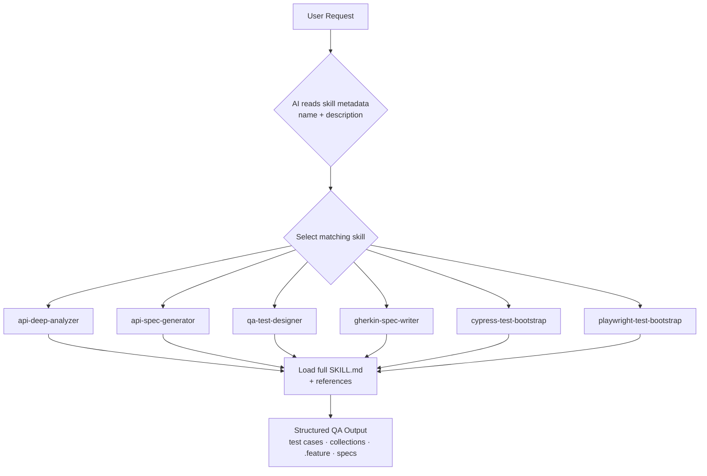
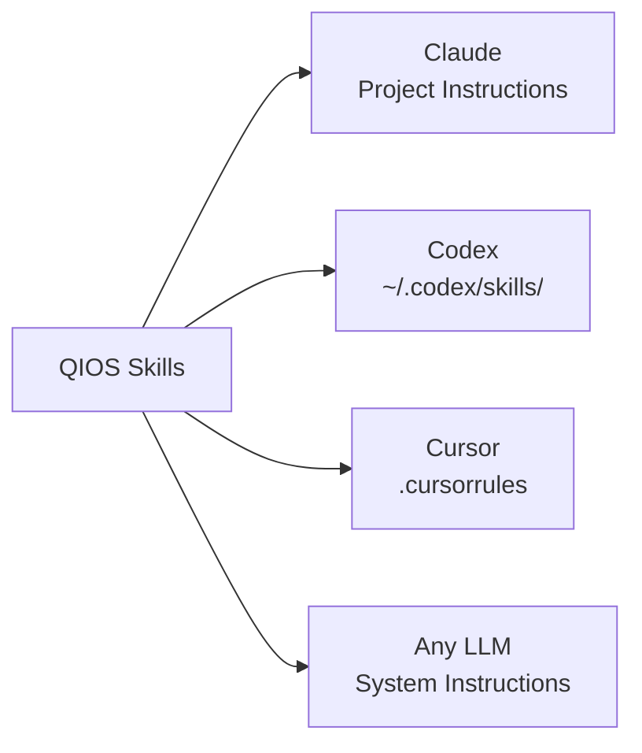

<div align="center">


# QIOS
### Quality Intelligence Operating System

**A structured QA framework that turns AI into a consistent, risk-aware, execution-ready testing system.**

[](LICENSE)
[](#compatibility)
[](skills/)
[](CHANGELOG.md)

---

<p>
  <strong>Created and maintained by <a href="https://www.linkedin.com/in/884055190/">Oumaima Mahmoudi</a></strong><br/>
  QA Engineer · Business Analyst · Fintech<br/>
  <em>"Quality is not a phase. It's a mindset."</em>
</p>

</div>

---

## Table of Contents

- [What is QIOS?](#what-is-qios)
- [Why QIOS?](#why-qios)
- [Approach](#approach)
- [How it works](#how-it-works)
- [Skills](#skills)
- [Project Structure](#project-structure)
- [Quick Start](#quick-start)
- [Compatibility](#compatibility)
- [Documentation](#documentation)
- [Examples](#examples)
- [Contributing](#contributing)
- [Author](#author)
- [License](#license)

---

## What is QIOS?

QIOS is a structured collection of **AI skills** for software testing. Each skill is a focused, versioned QA module loaded before an agent answers a testing request.

Rather than rebuilding QA context in every prompt, QIOS applies the relevant standards, coverage rules, and output structure automatically. The result is consistent, risk-aware, and reusable QA output across sessions.

> QIOS standardizes how QA reasoning is applied — not how prompts are written.
>
> **Works with:** Claude · Codex · Cursor · Any LLM with system instructions

---

## Why QIOS?

QIOS makes QA reasoning reusable, structured, and repeatable across sessions and projects. Standard prompting can produce useful answers, but it does not preserve QA structure, coverage discipline, or output consistency by default.

| Without QIOS | With QIOS |
|---|---|
| Re-explain QA context in every session | Agent keeps QA context, standards, and structure available |
| Outputs vary from one prompt to another | Outputs stay structured, repeatable, and risk-tagged |
| Test coverage is assembled manually | Happy path, negative, edge, and security coverage are generated systematically |
| Edge cases are easy to miss | Edge cases are explicitly built into the workflow |
| Knowledge is lost between sessions | QA knowledge is versioned in Git and shared across projects |

---

## Approach

QIOS treats QA as a structured engineering discipline rather than a prompt-based activity.  
Each skill encodes coverage logic, risk awareness, and output standards so the agent operates within a consistent QA framework and produces reusable deliverables.

---

## How it works

QIOS uses a selective loading model: the agent reads skill metadata first, selects the best match, then loads only the detailed instructions it needs.



---

## Skills

Each skill covers a distinct QA task and is selected from request intent.

| Skill | Purpose | Trigger phrases |
|---|---|---|
| [`api-deep-analyzer`](skills/api-deep-analyzer/) | Generate complete API test coverage from an endpoint or spec | *"analyze this API", "test cases for this endpoint"* |
| [`api-spec-generator`](skills/api-spec-generator/) | Generate importable Postman and Bruno collections | *"generate Postman collection", "Bruno spec"* |
| [`qa-test-designer`](skills/qa-test-designer/) | Build a structured test plan from a User Story or Jira ticket | *"test cases for this US", "test plan"* |
| [`gherkin-spec-writer`](skills/gherkin-spec-writer/) | Convert requirements into BDD `.feature` files | *"write Gherkin", "generate .feature file"* |
| [`cypress-test-bootstrap`](skills/cypress-test-bootstrap/) | Scaffold Cypress automation projects and reusable E2E specs | *"init Cypress", "scaffold E2E tests"* |
| [`playwright-test-bootstrap`](skills/playwright-test-bootstrap/) | Scaffold Playwright automation projects and reusable E2E specs | *"init Playwright", "scaffold Playwright tests"* |

---

## Project Structure

```text
QIOS/
├── README.md
├── AGENTS.md                        ← Global AI working agreement
├── CONTRIBUTING.md
├── CHANGELOG.md
├── LICENSE
├── .gitignore
├── .github/
│   └── ISSUE_TEMPLATE/
│       ├── bug_report.md           ← Bug report template
│       └── new_skill_request.md    ← New skill proposal template
│
├── skills/
│   ├── _shared/                     ← Shared references across all skills
│   │   ├── api-testing-checklist.md
│   │   ├── qa-risk-classification.md
│   │   ├── test-case-template.md
│   │   └── gherkin-style-guide.md
│   │
│   ├── api-deep-analyzer/           ← Analyze APIs, generate test coverage
│   │   ├── SKILL.md
│   │   ├── README.md
│   │   ├── examples/
│   │   ├── references/
│   │   └── scripts/
│   │
│   ├── api-spec-generator/          ← Generate Postman/Bruno collections
│   ├── qa-test-designer/            ← Test plans from User Stories
│   ├── gherkin-spec-writer/         ← BDD .feature files
│   ├── cypress-test-bootstrap/      ← Cypress project scaffolding
│   └── playwright-test-bootstrap/   ← Playwright project scaffolding
│
├── docs/
│   ├── architecture.md              ← How QIOS works (with diagrams)
│   ├── usage.md                     ← Install and usage guide
│   └── examples.md                  ← Real-world usage walkthrough
│
├── templates/
│   ├── postman/                     ← Ready-to-import Postman collection
│   ├── bruno/                       ← Ready-to-import Bruno collection
│   └── cypress/                     ← Cypress project template
│
└── examples/
    ├── api/                         ← API test cases and collections
    ├── gherkin/                     ← `.feature` file examples
    ├── cypress/                     ← `.cy.js` spec examples
    └── playwright/                  ← `.spec.ts` examples
```

---

## Quick Start

Choose the installation mode that matches your usage: globally for your agent, or locally within a single repository.

### Install globally — Codex

```bash
git clone https://github.com/oumaimah-QA/QIOS
mkdir -p ~/.codex/skills
cp -r QIOS/skills/* ~/.codex/skills/
cp QIOS/AGENTS.md ~/.codex/AGENTS.md
```

### Install — Claude Projects

1. Open your Claude Project → **Project Instructions**
2. Paste the full content of `AGENTS.md`
3. For each skill you want available, paste its `SKILL.md` content

### Install — Per project

```bash
mkdir -p ./.codex/skills
cp -r QIOS/skills/* ./.codex/skills/
cp QIOS/AGENTS.md ./.codex/AGENTS.md
```

### Use

Describe the QA task in natural language. QIOS maps the request to the appropriate skill automatically.

```text
"Analyze POST /payment/transfer and generate all test cases"
# → triggers api-deep-analyzer

"Generate a Postman collection from this Swagger spec"
# → triggers api-spec-generator

"Write test cases for this user story: [paste US]"
# → triggers qa-test-designer

"Generate the .feature file for this feature"
# → triggers gherkin-spec-writer

"Scaffold a Cypress project for the wallet module"
# → triggers cypress-test-bootstrap

"Scaffold a Playwright project for the wallet module"
# → triggers playwright-test-bootstrap
```

---

## Compatibility

QIOS is agent-agnostic because its core assets are plain-text instructions, structured references, and reusable examples.



| Agent | Installation method |
|---|---|
| **Claude** | Project Instructions or system instructions |
| **Codex** | `~/.codex/skills/` — auto-loaded |
| **Cursor** | `.cursorrules` + SKILL.md content |
| **Any LLM** | Inject `AGENTS.md` plus the relevant `SKILL.md` as system instructions |

---

## Documentation

The repository is documented at both framework level and skill level, so the operating model and each skill can be reviewed independently.

| Document | Description |
|---|---|
| [Architecture](docs/architecture.md) | How QIOS works internally: loading model, skill selection, and structure |
| [Usage Guide](docs/usage.md) | Installation, triggering skills, and adding new skills |
| [Examples](docs/examples.md) | Real-world walkthrough of all 6 skills |
| [AGENTS.md](AGENTS.md) | Global AI working agreement to load into your agent |
| [Contributing](CONTRIBUTING.md) | How to add skills, report issues, and contribute |
| [Changelog](CHANGELOG.md) | Release history |

---

## Examples

Representative QIOS outputs are included directly in the repository:

| Example | File |
|---|---|
| API test cases — `POST /wallet/cashout` | [examples/api/cashout-test-cases.md](examples/api/cashout-test-cases.md) |
| Postman collection — wallet API | [examples/api/cashout-collection.json](examples/api/cashout-collection.json) |
| Gherkin `.feature` — money transfer | [examples/gherkin/transfer.feature](examples/gherkin/transfer.feature) |
| Cypress spec — money transfer | [examples/cypress/transfer.cy.js](examples/cypress/transfer.cy.js) |
| Playwright spec — money transfer | [examples/playwright/transfer.spec.ts](examples/playwright/transfer.spec.ts) |

---

## Contributing

See [CONTRIBUTING.md](CONTRIBUTING.md) for guidelines on:
- Adding a new skill
- Improving existing skills
- Reporting issues
- Using issue templates
- Sharing your QIOS setup

Contributions should preserve the same bar: clear triggers, structured outputs, and execution-ready QA content.

---

## Author

**Oumaima Mahmoudi**  
QA Engineer · Business Analyst · Fintech

*Focused on building structured, execution-ready QA systems.*

[](https://www.linkedin.com/in/884055190/)
[![GitHub]https://github.com/oumaimah-QA/QIOS

---

## License

MIT License — free to use, adapt, and build upon. See [LICENSE](LICENSE) for details.
